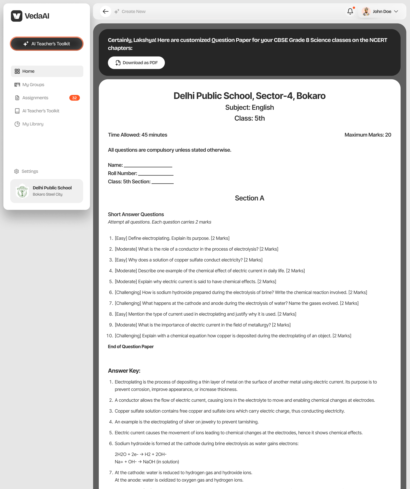
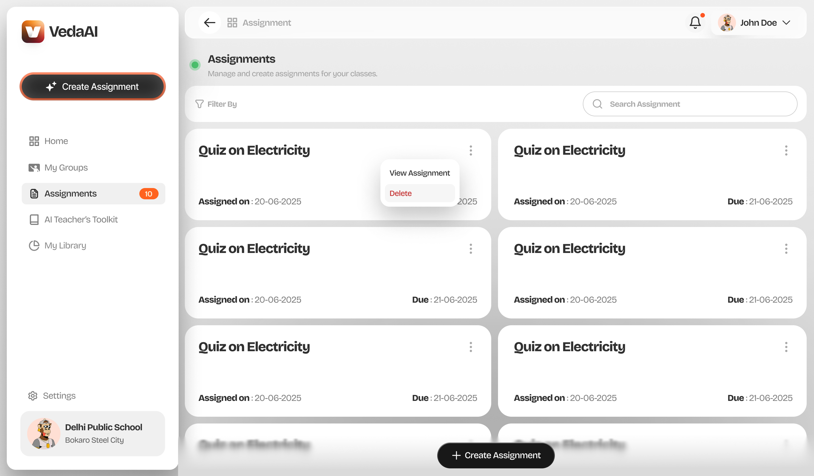
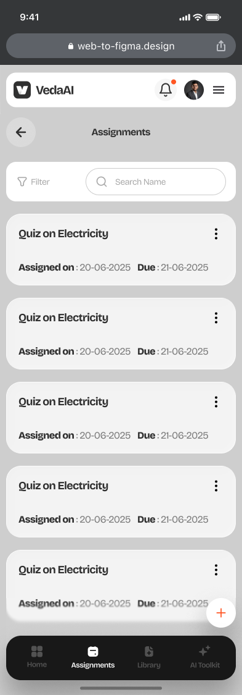
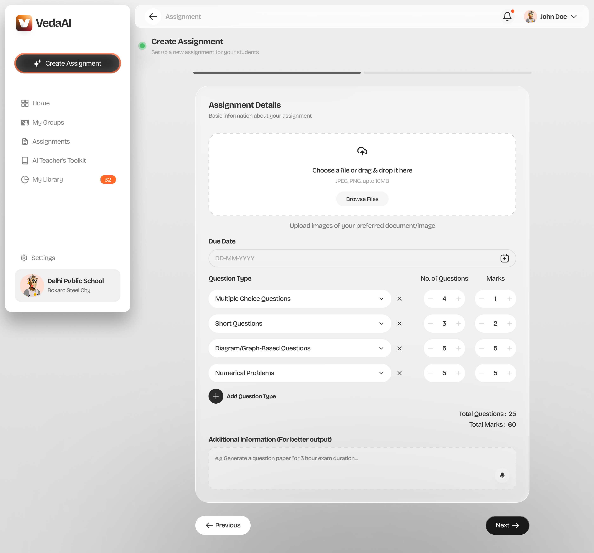

# VedaAI

Most AI tools hand you a list of questions. VedaAI hands you an exam paper: school name on top, sections with instructions, question numbers, marks per question, a difficulty split, an answer key, and real inline diagrams. Print it and walk into class.

Built for Indian school teachers, tuned for CBSE and ICSE, and it gets there in under two minutes.

**Live:** https://veda-ai-tawny.vercel.app
**API health:** https://api-production-eeb3.up.railway.app/api/health

---

## Screenshots

| Generated paper | Create flow |
|---|---|
|  |  |

| Dashboard | Upload reference material |
|---|---|
|  |  |

---

## What makes it different

**The output is a paper, not a list.** The prompt carries the full JSON schema the model must return: sections, question types, marks, difficulty, answers, plus `diagramDescription` and `diagramData` for graph questions. Every response is validated by `responseParser.ts` (Zod, strict) before a single field touches the database. Bad output fails fast, the job can be retried, and the database stays clean.

**Generation is async by design.** Gemini takes 15 to 30 seconds on a full paper. Running that inline would block the event loop and lose the result if the server restarted mid request. Instead the HTTP endpoint returns in under 50ms with a job ID, a BullMQ worker runs the LLM call in the background, and it emits Socket.IO progress events as it moves through stages. The client watches a live progress bar and navigates automatically when the paper lands.

**Diagram questions actually have a diagram.** When the question type is `diagram_graph`, Gemini returns a structured `diagramData` object next to the text: chart type (line, bar, scatter), axis labels with units, and 5 to 8 real data points. The prompt carries a fully worked example so the model fills it reliably, and `responseParser.ts` has a safety net: if a graph question ever comes back without data, it synthesises a clean fallback dataset so the paper never renders a blank box. The chart is inline SVG, so it prints crisp with no raster quality loss.

**The prompt ends with "Start your response with `{`".** Small instruction, real payoff. Without it, Gemini wraps its JSON in markdown fences half the time. The parser strips fences anyway, but forcing an open brace makes the whole response more reliable at zero cost.

---

## How generation works, step by step

1. The teacher fills in the form: subject, grade, due date, question types with counts and marks each, plus optional reference material or extra instructions.

2. `POST /api/assignments` creates a record (`jobStatus: 'queued'`), adds the job to BullMQ, and returns the ID. The HTTP response is back before a token is generated.

3. The worker picks it up and emits progress over Socket.IO at 10, 25, 70, 90, and 100 percent as it validates input, builds the prompt, calls Gemini, parses and validates the response, and writes the paper to MongoDB.

4. The client is watching. `useJobProgress` listens via Socket.IO and drives the progress bar in real time. On completion it refetches the assignment and the output page renders.

```
Browser (Next.js 14)                Express API              Data
  REST via Axios          ────────▶   Express + routes  ───▶  MongoDB Atlas
  Socket.IO client        ◀────────   Socket.IO server
                                       BullMQ worker      ───▶  Google Gemini (gemini-2.5-flash)
                                       Redis (Upstash)         job queue + progress
```

---

## What's in the box

**Question paper generator.** Six question types (MCQ, short answer, long answer, numerical, diagram or graph, true or false). Configurable count and marks per type. CBSE and ICSE difficulty split of roughly 40 percent easy, 40 percent moderate, 20 percent hard. Optional file upload for reference material (the first 3000 characters land in the prompt). School name, subject, grade, and a generated timestamp on every paper.

**Rubric and marking scheme.** Describe an assessment topic and get back a four level rubric (Excellent, Good, Satisfactory, Needs Work) with up to eight criteria. Same Gemini, Zod, render pipeline, different prompt shape.

**My Library.** Every completed paper lives here, searchable by title and filterable by subject. Redownload the PDF anytime without regenerating.

**Class Groups.** Organise students into named groups with a subject and grade. `groupId` is threaded through the types, schema, service, and the creation form.

**19 unit tests.** `promptBuilder.test.ts` (9 tests) covers total marks, question counts, section labels, reference material truncation, and the JSON start instruction. `responseParser.test.ts` (10 tests) covers valid input, code fence stripping, malformed JSON, missing fields, difficulty normalisation ("Medium" to "moderate"), and null coercion.

**Seed script.** `pnpm --filter @veda/api seed` drops three realistic demo assignments so reviewers see a populated dashboard.

---

## Monorepo layout

This is a pnpm workspace. Two deployable apps and one shared package, wired together with the `workspace:*` protocol so types stay in sync across the stack.

```
veda-ai/
  apps/
    api/                  Express + TypeScript backend (deploys to Railway)
      src/
        queues/           worker.ts: the full generation pipeline
        utils/            promptBuilder.ts, responseParser.ts (and their tests)
        services/         ai, assignment, pdf, rubric
        socket/           Socket.IO server + progress emitter
        models/           Mongoose schemas
    web/                  Next.js 14 App Router frontend (deploys to Vercel)
      app/                one folder per route, with a loading.tsx skeleton
      components/
        output/           QuestionPaperView, SectionBlock, QuestionItem, DiagramChart
        shared/           GenerationScreen (the document-animation loader)
        layout/           Sidebar, ShellLayout, MobileDock, NavigationProgress
      store/              Zustand: assignments, groups, user, notifications
  packages/
    shared/               @veda/shared: TypeScript types used by both apps
  docs/                   README screenshots
  pnpm-workspace.yaml     workspace definition (apps/* + packages/*)
```

Workspace level scripts run from the root:

```bash
pnpm dev         # api + web together via concurrently
pnpm build       # shared, then api, then web
pnpm typecheck   # tsc --noEmit across all three packages
```

---

## Quick start

```bash
git clone https://github.com/chiragkhatri19/veda-ai.git
cd veda-ai
pnpm install

# Start MongoDB and Redis locally, or point the env vars at Atlas + Upstash
docker-compose up -d

cp apps/api/.env.example apps/api/.env
# Add GEMINI_API_KEY to apps/api/.env

pnpm --filter @veda/api seed   # optional demo data
pnpm dev
```

Frontend runs at `http://localhost:3000`, API at `http://localhost:4000`.

---

## Environment variables

`apps/api/.env`

| Variable | Notes |
|---|---|
| `GEMINI_API_KEY` | Get one free at aistudio.google.com |
| `MONGODB_URI` | Local: `mongodb://localhost:27017/veda_ai`. Prod: Atlas connection string |
| `REDIS_URL` | Local: `redis://localhost:6379`. Prod: Upstash URL |
| `FRONTEND_URL` | Vercel URL in production, used for CORS |
| `PORT` | Defaults to 4000. Railway sets this automatically |

`apps/web/.env.local`

| Variable | Notes |
|---|---|
| `API_URL` | Backend URL. Used by Next.js rewrites server-side, never exposed to the browser |
| `NEXT_PUBLIC_SOCKET_URL` | Same backend URL. Socket.IO connects directly from the browser |

---

## Tech stack

| | |
|---|---|
| Frontend | Next.js 14 App Router, TypeScript, Tailwind CSS v3 |
| State | Zustand with persist and immer |
| Backend | Express 4, TypeScript |
| Database | MongoDB via Mongoose |
| Job queue | BullMQ over Redis (ioredis) |
| Real-time | Socket.IO |
| AI | Google Gemini `gemini-2.5-flash` |
| Testing | Vitest |
| Monorepo | pnpm workspaces |
| Deploy | Vercel (web) + Railway (api) + Atlas + Upstash |

---

## Running tests

```bash
pnpm --filter @veda/api test
```

---

## Limitations and what's next

Honest about the edges, since a take-home should be:

- **No auth yet.** The app is single tenant. School and teacher identity live in a client side Zustand store, not behind a login. Multi user would need real sessions and per user data scoping.
- **Reference material is truncated to 3000 characters.** Enough to steer the model, not enough for a full chapter. Chunking plus retrieval would lift that ceiling.
- **One LLM provider.** The generation path is wired to Gemini. The prompt, parse, and validate seam is provider agnostic, but swapping models would mean a second adapter.
- **Fallback diagram data is synthetic.** The safety net guarantees a chart always renders. It does not guarantee the numbers are pedagogically perfect when the model omits them. A targeted reprompt would be the stronger fix.
- **Next:** auth plus multi tenant data, PDF export of the answer key as a separate sheet, and a question bank so papers can be assembled from vetted items instead of generated cold each time.

---

## License

MIT. See [`package.json`](package.json).
